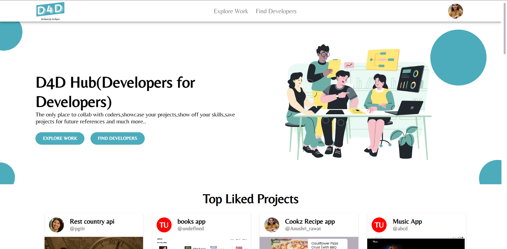
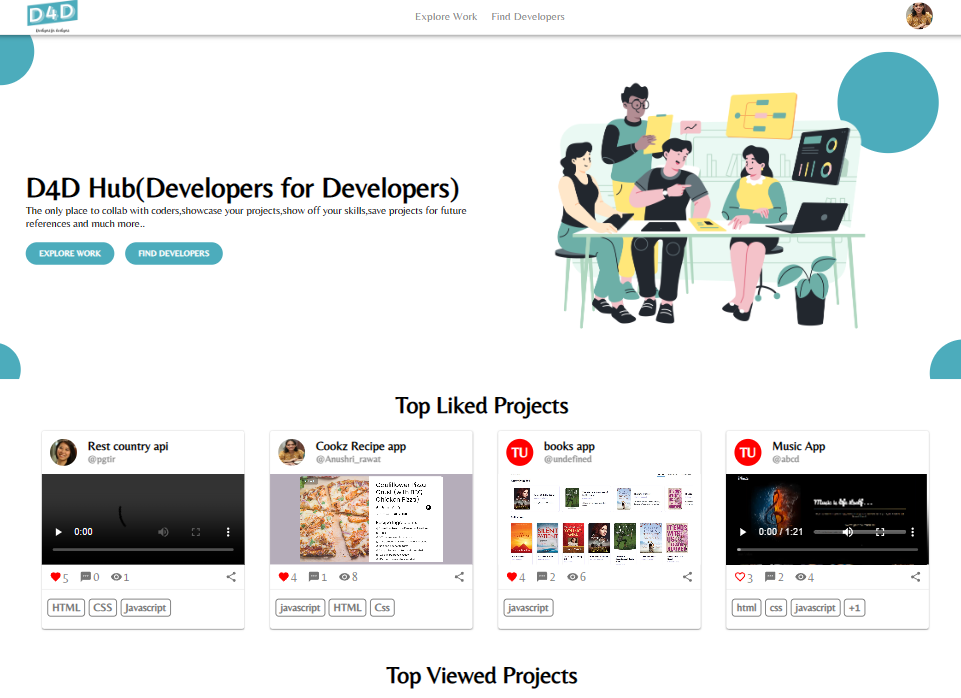
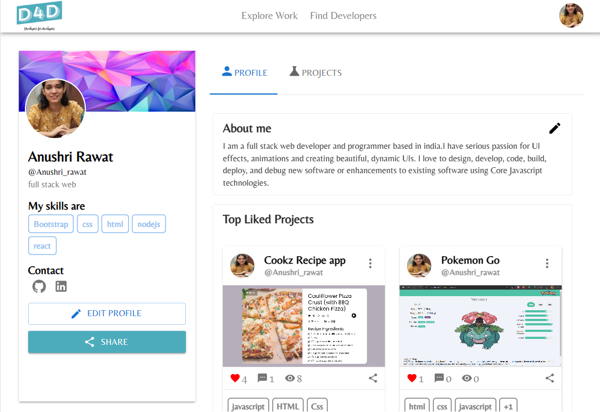
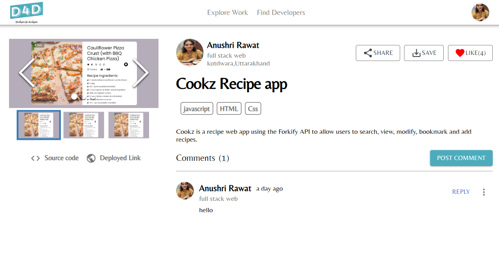
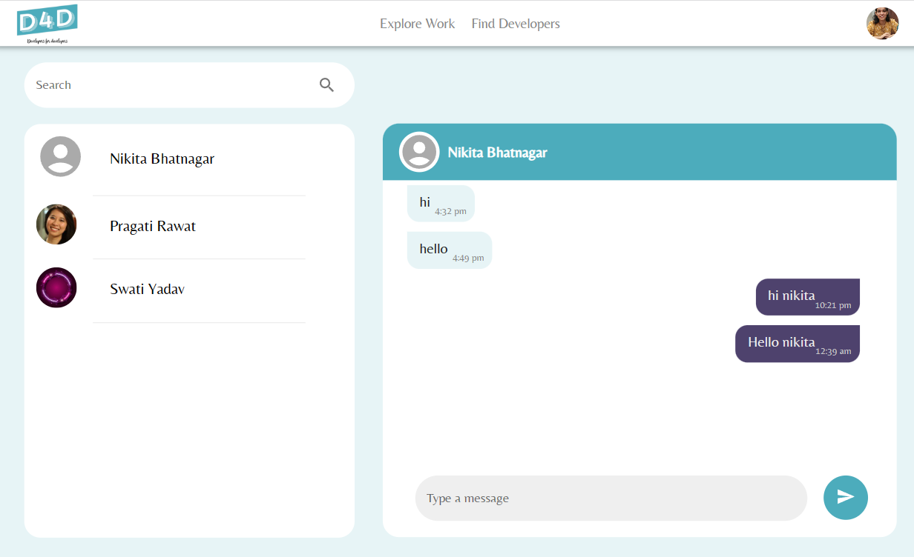
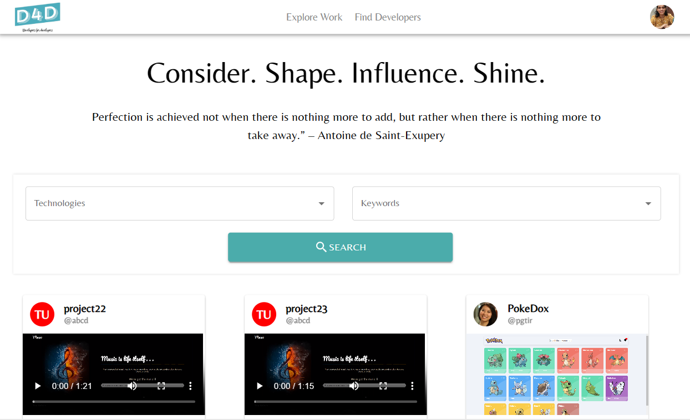
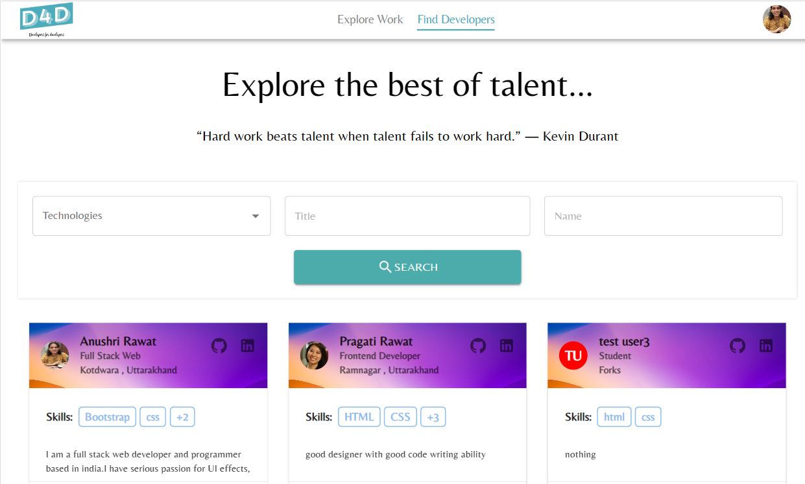

# D4D Developers for Developers Hub

A platform for developers to connect. They can create their portofolio by adding their experience, education, skills and other important information of their professional career.

Users can upload their projects and showcase their skills.The source code and videos attached to their projects provide others with a better understanding of the projects content.

User can chat with other developers.Save and share their profiles

Live link: <a href="https://d4d-developers-hub.netlify.app/" target="_blank"> Click here</a>

---

---

---

---

---

---

---

---

## Main Technologies

### Client Side

- [x] **[React](https://github.com/facebook/react)**
- [x] **[Redux](https://github.com/reactjs/redux)**
- [x] **[Material UI](https://mui.com/material-ui/)**
- [x] **[React-Router-DOM](https://github.com/ReactTraining/react-router/tree/master/packages/react-router-dom)**

#### Libraries used in Client-side

- [x] **[axios](https://github.com/axios/axios)**
- [x] **[react-moment](https://github.com/headzoo/react-moment)**
- [x] **[react-redux](https://github.com/reduxjs/react-redux)**
- [x] **[redux-thunk](https://github.com/reduxjs/redux-thunk)**

### Server Side

- [x] **[Node.js / Express](https://github.com/expressjs/express)**
- [x] **[MongoDB](https://github.com/mongodb/mongo)**
- [x] **[JWT](https://github.com/auth0/node-jsonwebtoken)**
- [x] **[Passport](http://www.passportjs.org/)**
- [x] **[Passport-jwt](https://github.com/themikenicholson/passport-jwt)**

#### Libraries used in Server-side

- [x] **[bcryptjs](https://github.com/dcodeIO/bcrypt.js)**
- [x] **[mongoose](http://mongoosejs.com/)**
- [x] **[jwt-decode](https://github.com/auth0/jwt-decode)**
- [x] **[moment](https://momentjs.com/)**
